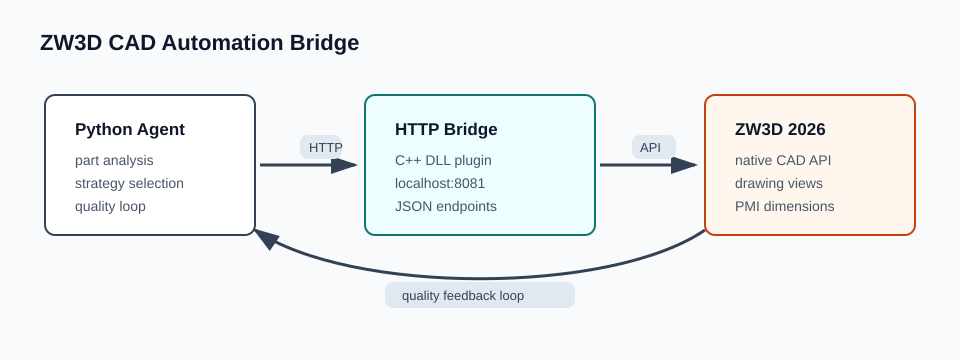
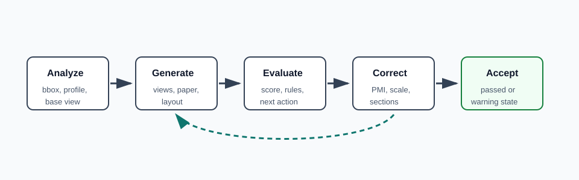

# ZW3D CAD Automation Bridge

[](https://github.com/Eeeeye/zw3d-cad-automation/actions/workflows/ci.yml)

An engineering portfolio project that connects ZW3D 2026 to a Python drafting
agent. It turns repetitive CAD drawing work into an automated loop: analyze a
part, choose a drafting strategy, generate orthographic views, evaluate drawing
quality, and apply corrective actions.



## Recruiter Snapshot

- Built a C++ HTTP plugin for ZW3D 2026 and a Python automation layer around it.
- Designed an agent loop for drawing generation, PMI creation, quality scoring,
  and automatic correction.
- Encoded reference-driven layout strategies for blocky, plate-like, elongated,
  and stepped mechanical parts.
- Packaged the project for public review without proprietary CAD files,
  generated reports, screenshots, or compiled binaries.

## Why This Project Matters

Mechanical drafting often requires repeated manual layout decisions: selecting
the base view, placing projected views, choosing paper size, adding PMI, and
checking whether dimensions overlap. This project explores an agentic workflow
where ZW3D remains the CAD engine, while Python coordinates decisions and quality
feedback.

The key idea is not just "send commands to CAD". The agent closes the loop:

1. Inspect the active part geometry.
2. Select a strategy based on the part profile.
3. Generate a drawing through the ZW3D plugin.
4. Evaluate measurable drawing quality rules.
5. Apply targeted corrections until the result is accepted or the budget ends.



## Technical Highlights

- **CAD plugin integration:** Native C++ DLL loaded by ZW3D and exposed through a
  local HTTP server on `localhost:8081`.
- **Python agent orchestration:** Retry-aware HTTP client, command wrappers, and
  an iterative drafting controller.
- **Reference-driven strategies:** Layout choices informed by real sample
  drawings and part profiles.
- **Quality feedback loop:** The agent reacts to evaluator actions such as
  `add_pmi`, `regenerate_orthographic_layout`, and
  `add_section_or_secondary_base_views`.
- **Reviewable public package:** Proprietary `.Z3PRT`, `.Z3DRW`, `.Z3ASM`,
  generated reports, and compiled binaries are excluded by default.

## Repository Map

```text
ZW3D_Bridge/       C++ HTTP plugin source, build scripts, Python bridge wrapper
ZW3D_Agent/        Python drafting agent, strategies, reference profiles
ZW3D_Automation/   PowerShell, batch, and Python automation entry points
examples/          Mock demo that runs without ZW3D
tests/             Unit tests for strategy mapping and the agent loop
docs/              Case study, demo notes, resume bullets, reference notes
assets/            Diagrams used by the portfolio README
```

## Try The Mock Demo

The mock demo does not require ZW3D. It simulates the HTTP server responses so
reviewers can inspect the agent behavior quickly.

```powershell
python examples\mock_agent_demo.py
```

Expected behavior:

- The fake part is analyzed as `plate_like`.
- The first generated drawing is missing PMI.
- The agent calls `add_pmi`.
- The second quality check is accepted.
- The script prints the final agent result and the fake CAD API call trace.

## Run With ZW3D

Requirements:

- Windows
- ZW3D 2026 installed at `C:\Program Files\ZWSOFT\ZW3D 2026`
- Visual Studio 2022 C++ Build Tools
- Python 3.10+

Install Python dependencies:

```powershell
python -m pip install -r requirements.txt
```

Build and install the ZW3D plugin:

```powershell
cd ZW3D_Bridge
.\compile_ps.ps1
```

Start ZW3D with the bridge plugin loaded, then run:

```powershell
python ZW3D_Agent\run_agent.py --active --wait
```

Or run against a specific local part:

```powershell
python ZW3D_Agent\run_agent.py --part "C:\path\to\part.Z3PRT" --wait
```

## HTTP Bridge

The bridge listens on `localhost:8081`. Useful checks:

```powershell
curl http://localhost:8081/status
curl http://localhost:8081/analyze_part
curl http://localhost:8081/evaluate_drawing_quality
```

Representative endpoints include:

- `GET /status`
- `GET /analyze_part`
- `GET /inspect_views`
- `GET /evaluate_drawing_quality`
- `POST /generate_smart_drafting`
- `POST /add_pmi`
- `POST /regenerate_drafting`
- `POST /add_section_view`
- `POST /execute`

## Verification

Run local checks:

```powershell
python -m compileall -q ZW3D_Agent ZW3D_Bridge ZW3D_Automation examples tests
python -m pytest -q
```

The GitHub Actions workflow runs the same Python compile and unit test checks.
Full end-to-end CAD tests still require Windows, ZW3D 2026, and the commercial
ZW3D SDK/runtime.

## Portfolio Docs

- [Case study](docs/case-study.md)
- [Demo guide](docs/demo.md)
- [Resume summary](docs/resume-summary.md)

## Current Limitations

- The public repository does not include proprietary CAD sample binaries.
- The C++ plugin build depends on local ZW3D SDK paths.
- CI validates Python logic and packaging, but cannot run ZW3D in GitHub-hosted
  runners.
- Some archived Chinese notes came from local experimentation and are kept as
  supporting material rather than polished public documentation.

## License

Copyright (c) 2026 Huang Wenye.

The original code and documentation in this repository are licensed under the
[MIT License](LICENSE).

ZW3D, the ZW3D SDK/runtime, and other third-party components remain subject to
their respective licenses and are not relicensed by this project. Obtain any
required third-party licenses separately before building or running the ZW3D
integration.
